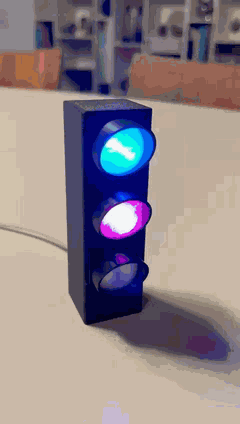
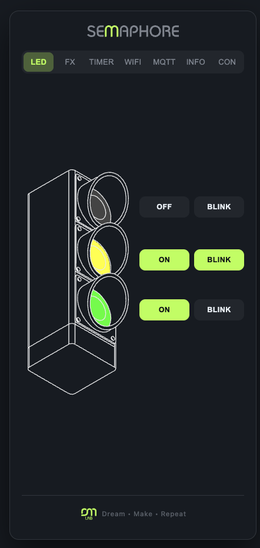
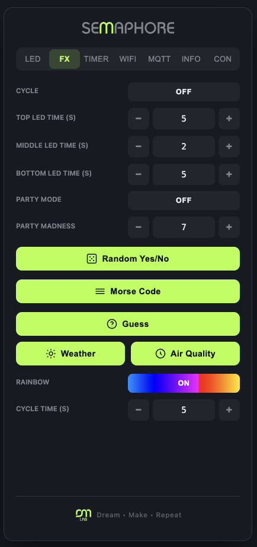
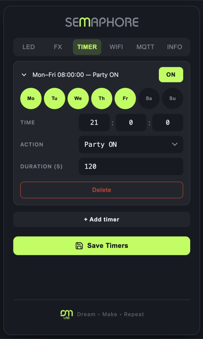
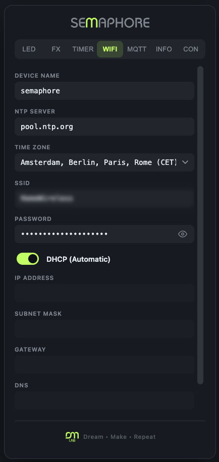
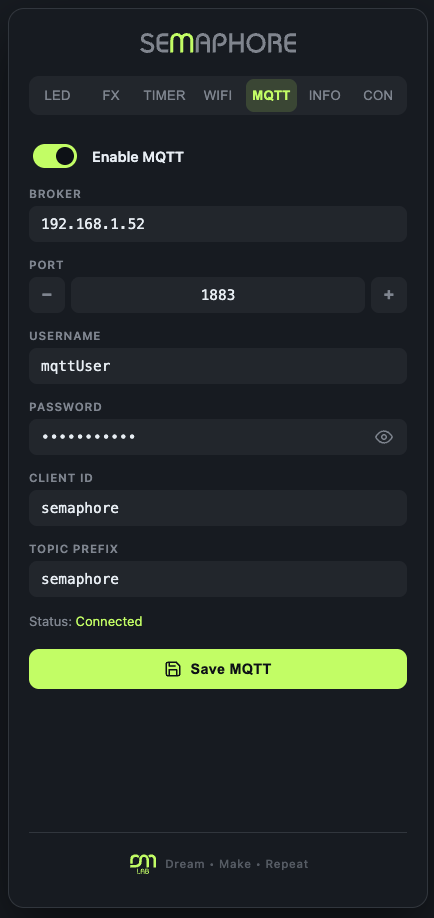
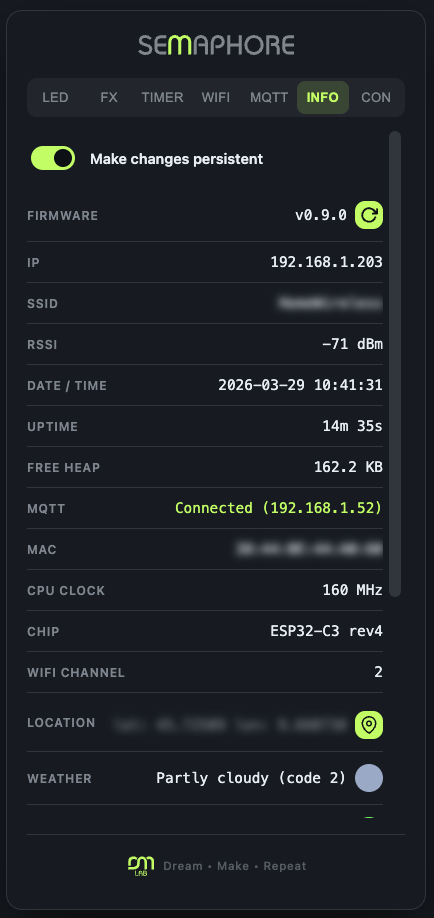

# ESP32-C3 Semaphore

<p align="center"></p>

A smart RGB traffic light based on the **Seeed XIAO ESP32-C3**, controllable via browser with a PWA web interface, MQTT/Home Assistant integration, and scheduled timers.

---

## Web Installer

Flash the firmware directly from the browser (Chrome / Edge) — no tools required:

**[https://gabemx5.github.io/ESP32-C3-Semaphore/](https://gabemx5.github.io/ESP32-C3-Semaphore/)**

After flashing, a Wi-Fi setup wizard (Improv Serial) will guide you through connecting the device to your network.

---

## Hardware

| Component | Detail |
|---|---|
| MCU | ESP32-C3 with built-in SSD1306 OLED 128×64 |
| LED | 3× WS2812B (NeoPixel) on GPIO 10 |
| Storage | LittleFS on internal flash |

The three LEDs are arranged vertically: **top = LED 2**, **middle = LED 1**, **bottom = LED 0**.

---

## Features

### LED Control
- Individual RGB color per LED
- ON / OFF / BLINK state (500 ms blink interval)
- Automatic configuration save to flash with 10 s debounce

### Effects (FX)

| Effect | Description |
|---|---|
| **Cycle** | Activates LEDs sequentially top→middle→bottom with configurable durations |
| **Party** | Random flashing on all LEDs with adjustable "madness" intensity (1–10) |
| **Rainbow** | Continuous HSV spectrum scroll with configurable cycle time |
| **Random Yes/No** | Middle LED blinks with increasing speed and reveals green (yes) or red (no) |
| **Guess** | Game: the user picks a LED, a 24-step 500 ms→50 ms animation runs, then the firmware reveals the winning LED |
| **Morse Code** | Flashes all LEDs in Morse code for any text entered by the user (A–Z, spaces supported) |
| **Weather Color** | Sets each LED to a color based on real-time weather data (see below) |

Effects are mutually exclusive: enabling one automatically disables the others.

### Weather Integration

The device fetches real-time weather from the [Open-Meteo API](https://open-meteo.com/) every 30 minutes based on the configured location.

The **Weather Color** effect maps live data to the three LEDs:

| LED | Data | Color mapping |
|---|---|---|
| Top (LED 2) | Weather condition | Yellow = clear day, Dark blue = clear night, Steel blue = cloudy, Gray = fog, Light blue = drizzle, Blue = rain, Ice white = snow, Purple = storm |
| Middle (LED 1) | Temperature | Blue = 5 °C → Red = 30 °C (linear HSV) |
| Bottom (LED 0) | Humidity | Yellow = 0% → Green = 50% → Blue = 100% |

Location is configurable from the Info tab via an interactive map overlay: tap anywhere on the map to set coordinates, which are saved to the device and used for all subsequent weather fetches.

### Timers
- Up to 50 timers with weekly scheduling (Monday–Sunday)
- Available actions: `all_off`, `led0/1/2` (with RGB color), `cycle`, `party`, `rainbow`, `random_yes_no`, `morse` (with text), `guess` (with target LED), `weather_color`
- **Optional duration** in seconds: when elapsed, the effect is automatically stopped (0 = no limit)
- Execution based on RTC via NTP

### Connectivity
- **WiFi** STA with DHCP or static IP; fallback to AP mode (`192.168.4.1`) after 3 failed attempts (3-minute timeout, then auto-restart)
- **Improv Wi-Fi Serial** first-boot wizard: after flashing, configure WiFi credentials directly from the browser via the web installer
- **mDNS** with configurable hostname (default `semaphore.local`)
- **WebSocket** real-time with application-level ping/pong (3 s interval, 2 s timeout)
- **OTA** (ArduinoOTA) for wireless firmware updates from PlatformIO
- **Firmware update from web UI**: the INFO tab allows updating firmware and filesystem directly from the latest GitHub release, with automatic config backup/restore
- **HTTP POST `/cmd`**: accepts the same JSON commands as WebSocket, useful for scripting or external integrations
- **MQTT** optional with Home Assistant auto-discovery support

### OLED Display
- Shows status messages at boot and operation feedback
- Auto-sleep after 10 s of inactivity

---

## Web Interface (PWA)

Accessible from a browser at `http://<ip>` or `http://semaphore.local`. Works as a Progressive Web App installable on iOS and Android.

### LED Tab


Direct control of the three LEDs with color picker, ON/OFF and BLINK toggles. Real-time SVG representation of the traffic light.

### FX Tab


Enable effects with configurable parameters:
- Cycle phase durations
- Party madness level
- Rainbow cycle time
- **Random Yes/No** button with dice animation
- **Guess** button with LED selection, spinning animation during the game, and WINNER/LOOSER card with dedicated icons
- **Morse Code** button: enter any text and all LEDs flash the message in Morse code
- **Weather Color** button (enabled only when weather data is available): triggers the weather effect instantly

### TIMER Tab


Add, edit and delete timers with day selection, time (HH:MM:SS), action and duration in seconds (0 = no limit). Persistent save to device.

### WIFI Tab


Configure device name, NTP server, timezone, WiFi credentials and static IP. Saving restarts the device.

### MQTT Tab


Configure broker, port, credentials, client ID and topic prefix. Real-time connection status.

### INFO Tab


System diagnostics: IP, SSID, RSSI, free heap, uptime, MQTT status, MAC address, CPU frequency, chip model, WiFi channel.

Weather data is displayed when a location is configured:
- **Weather** — current condition label and WMO code, with a colored dot reflecting the condition color
- **Temperature** — value in °C, with a colored dot from blue (cold) to red (hot)
- **Humidity** — value in %, with a colored dot from yellow (dry) to blue (humid)

All dot colors are computed by the firmware and sent via WebSocket.

Includes:
- **Make changes persistent** toggle: when disabled, LED and effect changes are not written to flash (useful for temporary configurations)
- **Backup** button: downloads a `semaphore-backup.json` file containing `config.json`, `wifi.json` and `mqtt.json`
- **Restore** button: uploads a backup file and automatically reboots the device to apply changes
- **Firmware update** button: fetches the latest release from GitHub and flashes firmware + filesystem OTA, with automatic config backup and restore

---

## MQTT / Home Assistant

The device automatically publishes discovery topics for Home Assistant:
- **Lights**: state and color/brightness control for each LED
- **Switches**: cycle, party, rainbow

Command topic: `{topicPrefix}/cmd` (JSON format, same protocol as WebSocket).

---

## Data Persistence

| File | Content |
|---|---|
| `/config.json` | LED colors, states and effect parameters |
| `/wifi.json` | WiFi credentials and IP configuration |
| `/mqtt.json` | MQTT broker configuration |
| `/timers.json` | Timer definitions |

---

## Wiring

### Components
- ESP32-C3 with built-in SSD1306 OLED display
- 3× WS2812B LEDs (or a strip of 3)

### Diagram

```
                    ┌─────────────────────┐
                    │     ESP32-C3        │
                    │   (built-in OLED)   │
                    │                     │
               5V  ─┤ 5V              GND ├─ GND
                    │                     │
                    │         D10 (GPIO10)├──────────┐
                    └─────────────────────┘          │
                                                     │
          ┌──────────────────────────────────────────┘
          │         WS2812B chain
          │
          ▼
    ┌──────────┐      ┌──────────┐      ┌──────────┐
    │  LED 2   │      │  LED 1   │      │  LED 0   │
    │  (top)   ├─DO──►│ (middle) ├─DO──►│ (bottom) │
    │ DIN VCC GND    │ DIN VCC GND    │ DIN VCC GND
    └──┬───┬───┘      └──────────┘      └──────────┘
       │   │
      5V  GND
```

### Pin Summary

| Signal | GPIO |
|---|---|
| LED data | GPIO 10 |
| Power (LEDs) | 5V |

---

## Build & Flash

The project uses **PlatformIO**.

```bash
# Build and flash via USB
pio run --target upload

# Upload filesystem (web UI)
pio run --target uploadfs

# OTA (after first flash)
# Enable upload_protocol = espota in platformio.ini
```

### Main Libraries

- `Adafruit NeoPixel`
- `ESPAsyncWebServer` + `AsyncTCP`
- `ArduinoJson`
- `U8g2`
- `PubSubClient`
- `Improv-WiFi-Library`

---

## Project Structure

```
├── src/
│   ├── main.cpp              # Entry point, WebSocket, MQTT, HTTP routing
│   ├── ledController.h       # LED effects and games
│   ├── timerController.h     # Weekly scheduler
│   ├── mqttController.h      # MQTT client + HA discovery
│   ├── networkManager.h      # WiFi STA/AP fallback
│   ├── configController.h    # Load/save config.json, dirty flag
│   ├── wifiConfigManager.h   # Network configuration persistence
│   ├── geoController.h       # Weather API (Open-Meteo) and location
│   ├── monitorController.h   # OLED display
│   ├── otaController.h       # Firmware + filesystem update from GitHub
│   └── improvController.h    # Improv Wi-Fi Serial first-boot wizard
└── data/                     # Web UI (LittleFS)
    ├── index.html
    ├── index.js
    ├── index.css
    └── manifest.json
```
